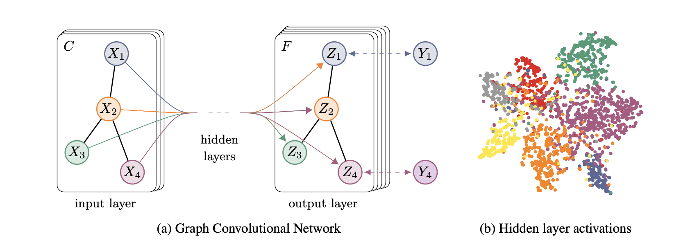

# Simple Graph Convolutional Neural Network

<hr>

## Contents

1. [Highlights](#Highlights)
2. [Requirements](#Requirements)
3. [Usage](#Usage)
4. [Results](#Results)


<hr>

## Highlights
This project is an implementation from scratch of a simple 2-layer GCN on the CORA dataset. Graph convolutional networks work by using standard convolutional layers to learn localized representations of nodes. 

</img>

<hr>

## Requirements
```shell
pip install -r requirements.txt
```

<hr>

## Usage
To replicate the reported results, clone this repo
```shell
cd your_directory git clone git@github.com:jordandeklerk/Simple-GNN.git
cd Simple-GNN
```
and run the main training script
```shell
python main.py 
```

<hr>

## Results
We tested our simple GNN on the CORA citation dataset
  * CORA
    * ```Simple GNN``` - 81.5% accuracy on the test data

Model Summary:
```
+----------------------+----------------------------------+----------------+----------+
| Layer                | Input Shape                      | Output Shape   | #Param   |
|----------------------+----------------------------------+----------------+----------|
| Net                  |                                  | [2708, 7]      | 23,063   |
| ├─(crd)CRD           | [2708, 1433], [2, 10556], [2708] | [2708, 16]     | 22,944   |
| │    └─(conv)GCNConv | [2708, 1433], [2, 10556]         | [2708, 16]     | 22,944   |
| ├─(cls)CLS           | [2708, 16], [2, 10556], [2708]   | [2708, 7]      | 119      |
| │    └─(conv)GCNConv | [2708, 16], [2, 10556]           | [2708, 7]      | 119      |
+----------------------+----------------------------------+----------------+----------+
```
   
<hr>

## Citations
```bibtex
@inproceedings{kipf2017semi,
  title={Semi-Supervised Classification with Graph Convolutional Networks},
  author={Kipf, Thomas N. and Welling, Max},
  booktitle={International Conference on Learning Representations (ICLR)},
  year={2017}
}
```
